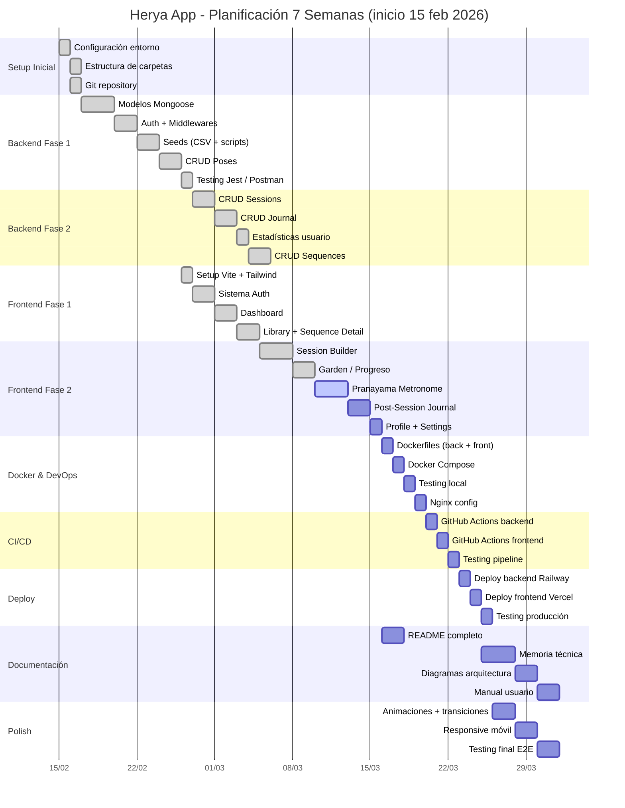

```mermaid
gantt
    title Herya App - Planificación 7 Semanas (inicio 15 feb 2026)
    dateFormat YYYY-MM-DD
    axisFormat %d/%m

    section Setup Inicial
    Configuración entorno           :done, setup1, 2026-02-15, 1d
    Estructura de carpetas          :done, setup2, 2026-02-16, 1d
    Git repository                  :done, setup3, 2026-02-16, 1d

    section Backend Fase 1
    Modelos Mongoose               :done, back1, 2026-02-17, 3d
    Auth + Middlewares             :done, back2, 2026-02-20, 2d
    Seeds (CSV + scripts)          :done, back3, 2026-02-22, 2d
    CRUD Poses                     :done, back4, 2026-02-24, 2d
    Testing Jest / Postman         :done, back5, 2026-02-26, 1d

    section Backend Fase 2
    CRUD Sessions                  :done, back6, 2026-02-27, 2d
    CRUD Journal                   :done, back7, 2026-03-01, 2d
    Estadísticas usuario           :done, back8, 2026-03-03, 1d
    CRUD Sequences                 :done, back9, 2026-03-04, 2d

    section Frontend Fase 1
    Setup Vite + Tailwind          :done, front1, 2026-02-26, 1d
    Sistema Auth                   :done, front2, 2026-02-27, 2d
    Dashboard                      :done, front3, 2026-03-01, 2d
    Library + Sequence Detail      :done, front4, 2026-03-03, 2d

    section Frontend Fase 2
    Session Builder                :done, front5, 2026-03-05, 3d
    Garden / Progreso              :done, front6, 2026-03-08, 2d
    Pranayama Metronome            :active, front7, 2026-03-10, 3d
    Post-Session Journal           :front8, after front7, 2d
    Profile + Settings             :front9, after front8, 1d

    section Docker & DevOps
    Dockerfiles (back + front)     :docker1, 2026-03-16, 1d
    Docker Compose                 :docker2, after docker1, 1d
    Testing local                  :docker3, after docker2, 1d
    Nginx config                   :docker4, after docker3, 1d

    section CI/CD
    GitHub Actions backend         :cicd1, after docker4, 1d
    GitHub Actions frontend        :cicd2, after cicd1, 1d
    Testing pipeline               :cicd3, after cicd2, 1d

    section Deploy
    Deploy backend Railway         :deploy1, after cicd3, 1d
    Deploy frontend Vercel         :deploy2, after deploy1, 1d
    Testing producción             :deploy3, after deploy2, 1d

    section Documentación
    README completo                :doc1, 2026-03-16, 2d
    Memoria técnica                :doc2, 2026-03-25, 3d
    Diagramas arquitectura         :doc3, after doc2, 2d
    Manual usuario                 :doc4, after doc3, 2d

    section Polish
    Animaciones + transiciones     :polish1, after deploy3, 2d
    Responsive móvil               :polish2, after polish1, 2d
    Testing final E2E              :polish3, after polish2, 2d
```

