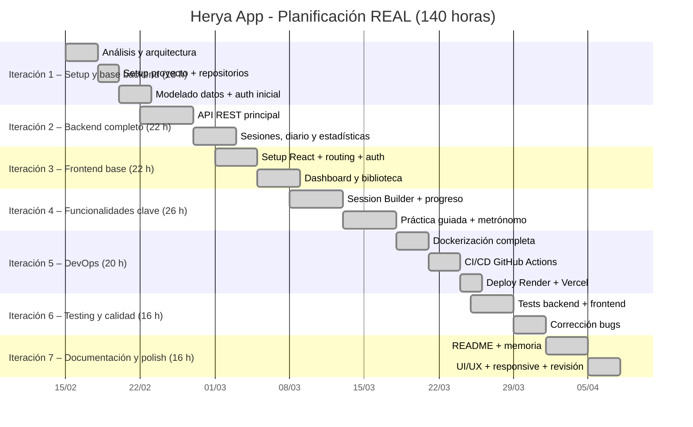

```mermaid
gantt
    title Herya App - Planificación REAL (140 horas)
    dateFormat YYYY-MM-DD
    axisFormat %d/%m

    section Iteración 1 – Setup y base backend (18 h)
    Análisis y arquitectura            :done, i1a, 2026-02-15, 3d
    Setup proyecto + repositorios      :done, i1b, after i1a, 2d
    Modelado datos + auth inicial      :done, i1c, after i1b, 3d

    section Iteración 2 – Backend completo (22 h)
    API REST principal                 :done, i2a, 2026-02-22, 5d
    Sesiones, diario y estadísticas    :done, i2b, after i2a, 4d

    section Iteración 3 – Frontend base (22 h)
    Setup React + routing + auth       :done, i3a, 2026-03-01, 4d
    Dashboard y biblioteca             :done, i3b, after i3a, 4d

    section Iteración 4 – Funcionalidades clave (26 h)
    Session Builder + progreso         :done, i4a, 2026-03-08, 5d
    Práctica guiada + metrónomo        :done, i4b, after i4a, 5d

    section Iteración 5 – DevOps (20 h)
    Dockerización completa             :done, i5a, 2026-03-18, 3d
    CI/CD GitHub Actions               :done, i5b, after i5a, 3d
    Deploy Render + Vercel             :done, i5c, after i5b, 2d

    section Iteración 6 – Testing y calidad (16 h)
    Tests backend + frontend           :done, i6a, 2026-03-25, 4d
    Corrección bugs                    :done, i6b, after i6a, 3d

    section Iteración 7 – Documentación y polish (16 h)
    README + memoria                   :done, i7a, 2026-04-01, 4d
    UI/UX + responsive + revisión      :done, i7b, after i7a, 3d
```

