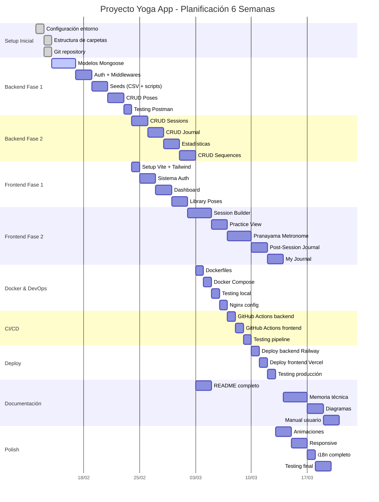

```mermaid
gantt
    title Proyecto Yoga App - Planificación 6 Semanas
    dateFormat YYYY-MM-DD
    axisFormat %d/%m
    
    section Setup Inicial
    Configuración entorno           :done, setup1, 2024-02-12, 1d
    Estructura de carpetas          :done, setup2, 2024-02-13, 1d
    Git repository                  :done, setup3, 2024-02-13, 1d
    
    section Backend Fase 1
    Modelos Mongoose               :active, back1, 2024-02-14, 3d
    Auth + Middlewares             :back2, after back1, 2d
    Seeds (CSV + scripts)          :back3, after back2, 2d
    CRUD Poses                     :back4, after back3, 2d
    Testing Postman                :back5, after back4, 1d
    
    section Backend Fase 2
    CRUD Sessions                  :back6, after back5, 2d
    CRUD Journal                   :back7, after back6, 2d
    Estadísticas                   :back8, after back7, 2d
    CRUD Sequences                 :back9, after back8, 2d
    
    section Frontend Fase 1
    Setup Vite + Tailwind          :front1, after back5, 1d
    Sistema Auth                   :front2, after front1, 2d
    Dashboard                      :front3, after front2, 2d
    Library Poses                  :front4, after front3, 2d
    
    section Frontend Fase 2
    Session Builder                :front5, after front4, 3d
    Practice View                  :front6, after front5, 2d
    Pranayama Metronome           :front7, after front6, 3d
    Post-Session Journal           :front8, after front7, 2d
    My Journal                     :front9, after front8, 2d
    
    section Docker & DevOps
    Dockerfiles                    :docker1, after back9, 1d
    Docker Compose                 :docker2, after docker1, 1d
    Testing local                  :docker3, after docker2, 1d
    Nginx config                   :docker4, after docker3, 1d
    
    section CI/CD
    GitHub Actions backend         :cicd1, after docker4, 1d
    GitHub Actions frontend        :cicd2, after cicd1, 1d
    Testing pipeline               :cicd3, after cicd2, 1d
    
    section Deploy
    Deploy backend Railway         :deploy1, after cicd3, 1d
    Deploy frontend Vercel         :deploy2, after deploy1, 1d
    Testing producción             :deploy3, after deploy2, 1d
    
    section Documentación
    README completo                :doc1, after back9, 2d
    Memoria técnica                :doc2, after front9, 3d
    Diagramas                      :doc3, after doc2, 2d
    Manual usuario                 :doc4, after doc3, 2d
    
    section Polish
    Animaciones                    :polish1, after deploy3, 2d
    Responsive                     :polish2, after polish1, 2d
    i18n completo                  :polish3, after polish2, 1d
    Testing final                  :polish4, after polish3, 2d
```

