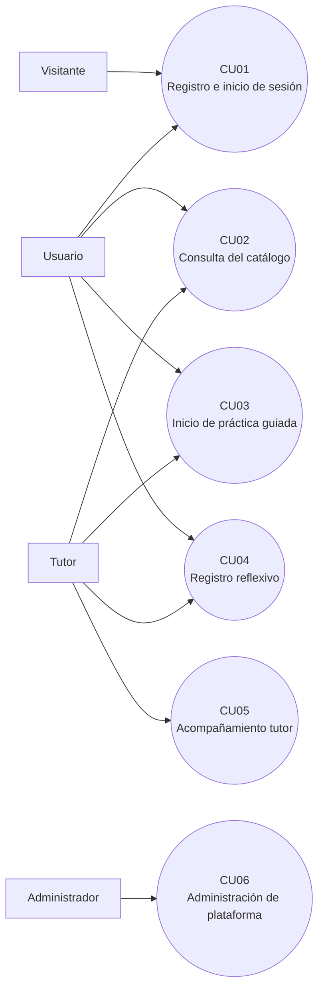
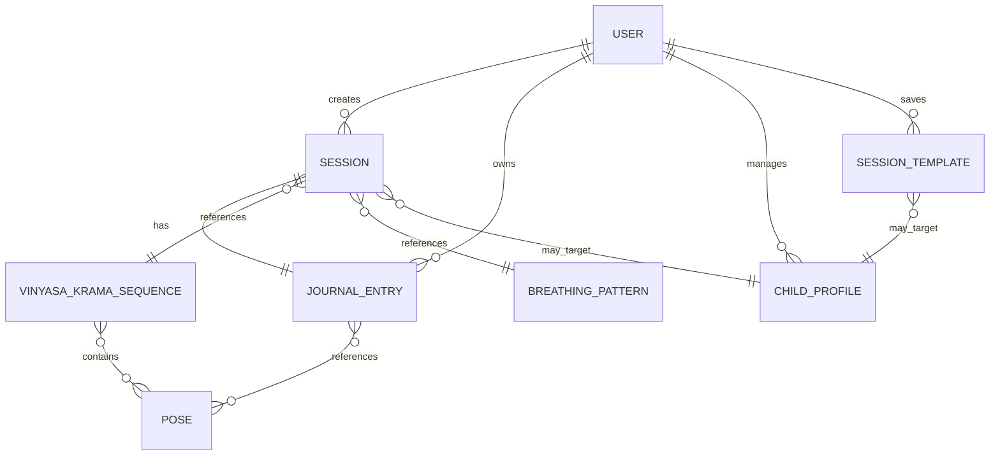

# HERYA

## Diseño y desarrollo de una aplicación web para la práctica, reflexión y acompañamiento de yoga Vinyasa Krama

Proyecto intermodular del ciclo de Técnico Superior en Desarrollo de Aplicaciones Web (DAW)  
Versión actualizada: 23 de abril de 2026

---

## Índice

1. Resumen
2. Abstract
3. Justificación del proyecto
   1. Contexto y problemática
   2. Vinyasa Krama como marco metodológico diferencial
   3. Análisis actualizado del mercado
   4. Público objetivo
4. Introducción
   1. Contexto del proyecto
   2. Problema que resuelve Herya
   3. Objetivos del proyecto
   4. Alcance y limitaciones
   5. Funcionalidades principales
5. Objetivos y requisitos
   1. Trazabilidad entre objetivos y sistema
   2. Requisitos funcionales
   3. Requisitos no funcionales
6. Descripción del sistema
   1. Visión general
   2. Arquitectura de la solución
   3. Roles de usuario
   4. Casos de uso principales
7. Diseño del sistema
   1. Modelo de datos
   2. Diseño backend
   3. Diseño frontend
   4. Diseño de interacción y pantallas
8. Tecnología
   1. Backend
   2. Frontend
   3. Calidad, testing y DevOps
9. Metodología
   1. Enfoque adoptado
   2. Planificación por fases
   3. Gestión del código fuente
   4. Presupuesto estimado
10. Implementación
    1. Estructura real del repositorio
    2. Módulos principales del backend
    3. Módulos principales del frontend
11. Testing y calidad
    1. Estrategia de calidad
    2. Suite automatizada actual
    3. Verificación manual y riesgos residuales
    4. Linting y consistencia del código
12. Despliegue
    1. Topología de despliegue soportada por el repositorio
    2. Contenedores Docker
    3. CI/CD
    4. Variables de entorno
13. Trabajos futuros
14. Conclusiones
15. Referencias

---

## 1. Resumen

Herya es una aplicación web full-stack orientada al acompañamiento de la práctica personal de yoga desde la metodología Vinyasa Krama. El sistema integra una biblioteca técnica de posturas y patrones de respiración, un flujo guiado de práctica configurable, registro de sesiones, diario reflexivo, progresión de secuencias, analítica básica, gestión de preferencias y soporte diferenciado para tres roles: practicante, tutor y administrador.

La solución se implementa como una arquitectura desacoplada SPA + API REST. El backend está construido con Node.js, Express 5 y MongoDB mediante Mongoose 9; ofrece autenticación JWT, recuperación de contraseña por correo, documentación Swagger/OpenAPI, rate limiting, subida de imágenes a Cloudinary y administración de contenido y usuarios. El frontend es una SPA desarrollada con React 19, React Router 7, Vite 7, Tailwind CSS 4 y Framer Motion, con foco en una experiencia guiada y móvil.

El proyecto se distribuye como monorepo con documentación técnica, Docker para desarrollo y simulación local de producción, workflows de GitHub Actions para integración continua, despliegue del frontend en Vercel y publicación opcional de imágenes Docker en GHCR. El repositorio incluye además un blueprint de Render para el backend y documentación operativa complementaria.

Palabras clave: yoga, Vinyasa Krama, aplicación web, API REST, React, Express, MongoDB, tutor mode, diario reflexivo, DevOps.

---

## 2. Abstract

Herya is a full-stack web application designed to support personal yoga practice through the Vinyasa Krama methodology. The platform combines a technical library of poses and breathing patterns, a configurable guided practice flow, session logging, reflective journaling, progression tracking, basic analytics, user preferences, and differentiated support for three roles: practitioner, tutor, and administrator.

The solution follows a decoupled SPA + REST API architecture. The backend is built with Node.js, Express 5, and MongoDB through Mongoose 9, and includes JWT authentication, email-based password reset, Swagger/OpenAPI documentation, rate limiting, Cloudinary media uploads, and content and user administration. The frontend is a SPA developed with React 19, React Router 7, Vite 7, Tailwind CSS 4, and Framer Motion, with special attention to a guided and mobile-first experience.

The project is organized as a monorepo with technical documentation, Docker support for development and production-like local execution, GitHub Actions workflows for continuous integration, Vercel deployment for the frontend, and optional Docker image publishing to GHCR. The repository also provides a Render blueprint for backend deployment and complementary operational documentation.

Keywords: yoga, Vinyasa Krama, web application, REST API, React, Express, MongoDB, tutor mode, reflective journaling, DevOps.

---

## 3. Justificación del proyecto

### 3.1. Contexto y problemática

El crecimiento del yoga en Occidente ha venido acompañado de una fuerte digitalización de la oferta de bienestar, pero no siempre de una representación rigurosa de sus métodos tradicionales. Las plataformas generalistas tienden a priorizar el consumo rápido de clases, la personalización comercial y la retención del usuario, mientras que dejan en segundo plano la progresión pedagógica, la adaptación fina al practicante y la dimensión reflexiva de la práctica.

En ese contexto, Herya nace para cubrir una necesidad específica: ofrecer una herramienta digital que no reduzca la práctica a una colección de vídeos o temporizadores aislados, sino que articule técnica, progresión, respiración, registro y reflexión desde una lógica coherente con Vinyasa Krama.

La oportunidad del proyecto se sostiene por tres motivos:

- Existe un espacio entre las apps de clases bajo demanda y las herramientas especializadas para profesorado.
- El dominio Vinyasa Krama es estructurable técnicamente: familias, niveles, relaciones entre posturas, progresiones y recomendaciones.
- El acompañamiento reflexivo posterior a la sesión aporta un valor diferencial frente a soluciones centradas solo en la ejecución.

Desde una perspectiva académica, el proyecto también es pertinente porque permite integrar competencias de arquitectura web, modelado documental, desarrollo frontend y backend, testing, despliegue y documentación técnica dentro de un caso de uso realista.

### 3.2. Vinyasa Krama como marco metodológico diferencial

Vinyasa Krama no es solo una etiqueta estilística, sino un sistema pedagógico basado en progresión ordenada, adaptación al practicante y coordinación consciente entre respiración y movimiento. Frente a propuestas más estandarizadas o cerradas, este método resulta especialmente adecuado para una aplicación digital por varias razones:

- Tiene bloques y familias identificables, lo que facilita el modelado de datos.
- Permite representar niveles progresivos y desbloqueo de secuencias.
- Integra respiración, observación corporal y reflexión posterior.
- Se presta a una personalización significativa sin perder coherencia metodológica.

Esto convierte a Herya en algo más que un catálogo de contenidos: la aplicación actúa como una capa de estructuración, acompañamiento y memoria de práctica.

### 3.3. Análisis actualizado del mercado

La comparación se ha realizado con base en la información pública disponible en las webs oficiales consultadas el 23 de abril de 2026. El objetivo no es afirmar que otras plataformas carecen por completo de profundidad, sino identificar qué tipo de propuesta ofrecen y dónde se sitúa Herya.

| Plataforma | Enfoque principal | Personalización | Registro / diario | Enfoque VK específico | Observación |
|---|---|---|---|---|---|
| Down Dog | Generación automática de prácticas de yoga y fitness | Alta | No se ha identificado un diario reflexivo comparable | No | Destaca por variación automática y parámetros de sesión [R12] |
| Glo | Clases online de yoga, pilates y bienestar | Media | No se ha identificado un módulo equivalente a diario vinculado a sesión | No | Catálogo amplio y orientación wellness generalista [R13] |
| Alo Moves | Clases en vídeo bajo demanda | Media | No se ha identificado un sistema reflexivo por sesión | No | Gran foco en series y clases, no en progresión VK [R14] |
| Insight Timer | Meditación, mindfulness, yoga y breathwork | Media | Sí, con journaling y stats en su ecosistema | No | Excelente para meditación y registro, pero no para VK [R15] |
| Sequence Wiz | Herramienta para profesorado, secuenciación y notas | Alta | Sí, con perfiles y notas de sesión | Parcial | Muy fuerte en secuencias y práctica profesional, pero no orientada a una experiencia de práctica personal VK integrada [R16] |
| Herya | Biblioteca técnica + práctica guiada + reflexión | Alta | Sí, con diario ligado a sesión y analítica | Sí | Integra progresión VK, práctica guiada, tutor mode y administración |

La revisión actualizada muestra que la propuesta de Herya sigue siendo diferencial, pero conviene formular esa diferencia con precisión:

- No es correcto sostener que ninguna plataforma permita registrar o reflexionar.
- Sí es defendible que Herya combina en una sola solución: biblioteca técnica VK, práctica guiada por bloques, progresión por familias y niveles, diario reflexivo post-sesión y soporte específico para tutor.

### 3.4. Público objetivo

Herya se orienta a tres perfiles principales:

#### Practicante individual

Usuario que desea estructurar su práctica, consultar información técnica y registrar tanto la ejecución como la experiencia subjetiva de la sesión.

#### Tutor o acompañante

Perfil que necesita adaptar la práctica a infancia o a contextos de co-regulación. Este usuario se beneficia de perfiles de menores, señales de apoyo, pausas seguras, anclas corporales y analítica tutor.

#### Administrador de contenido

Perfil responsable de mantener la calidad del catálogo, la consistencia metodológica y la moderación básica del sistema. Gestiona usuarios, posturas, patrones respiratorios y secuencias.

De manera secundaria, el sistema también resulta útil para estudiantes avanzados, personas en formación y contextos pedagógicos donde la trazabilidad de la práctica es relevante.

---

## 4. Introducción

### 4.1. Contexto del proyecto

El proyecto se desarrolla como trabajo intermodular del ciclo DAW y se plantea como una aplicación web realista, desplegable y documentada. Su valor académico reside en que obliga a resolver problemas propios de un producto completo:

- modelado documental complejo,
- API REST versionada,
- SPA con autenticación y rutas protegidas,
- testing automatizado,
- contenedorización y CI/CD,
- y documentación alineada con la implementación.

### 4.2. Problema que resuelve Herya

Herya aborda cinco carencias detectadas en el análisis de contexto:

1. Ausencia de progresión específica en Vinyasa Krama.
2. Dispersión de información técnica sobre asanas y respiración.
3. Falta de un espacio estructurado de reflexión post-práctica.
4. Escasez de herramientas que integren respiración, práctica y diario en un único flujo.
5. Insuficiente soporte digital para acompañamiento tutor y regulación compartida.

La propuesta de valor del sistema consiste en unificar consulta, práctica guiada, registro y reflexión en un entorno técnicamente coherente con el dominio.

### 4.3. Objetivos del proyecto

#### Objetivo general

Diseñar y desarrollar una aplicación web full-stack que acompañe la práctica de yoga Vinyasa Krama mediante biblioteca técnica, sesiones guiadas, seguimiento de progreso y diario reflexivo, incorporando además capacidades de administración y soporte tutor.

#### Objetivos específicos

| ID | Objetivo específico |
|---|---|
| OE1 | Desarrollar una API REST segura, documentada y mantenible para todos los recursos del dominio |
| OE2 | Implementar un frontend SPA responsivo y guiado que consuma la API y gestione autenticación, práctica y reflexión |
| OE3 | Modelar la progresión Vinyasa Krama mediante familias, niveles y relaciones entre secuencias y posturas |
| OE4 | Ofrecer un flujo completo de práctica: selección, construcción, ejecución, registro y diario |
| OE5 | Incorporar personalización mediante preferencias, recomendaciones y configuración de práctica |
| OE6 | Añadir soporte específico para tutor mediante perfiles infantiles, anclas de seguridad y métricas de acompañamiento |
| OE7 | Automatizar validación y entrega mediante testing, Docker y workflows de integración continua |

### 4.4. Alcance y limitaciones

#### Incluido en esta versión

- Biblioteca de posturas con información técnica y relaciones entre poses.
- Biblioteca de patrones de respiración.
- Secuencias de Vinyasa Krama clasificadas por familia y nivel.
- Inicio de práctica guiada por bloques.
- Registro de sesiones y diario reflexivo.
- Progresión y estadísticas básicas.
- Soporte de roles `user`, `tutor` y `admin`.
- Panel de administración.
- Recuperación de contraseña.
- Docker, documentación técnica y workflows CI/CD.

#### Fuera del alcance actual

- Streaming de vídeo o catálogo multimedia extenso.
- Notificaciones push reales.
- Modo offline completo con service worker y sincronización.
- Aplicaciones nativas iOS/Android.
- Pasarela de pago o monetización.
- E2E automatizado con Playwright o Cypress.
- Integración con wearables o biometría externa.

### 4.5. Funcionalidades principales

Las funcionalidades implementadas o claramente soportadas por el repositorio son:

- autenticación con JWT y recuperación de contraseña,
- gestión de perfil, idioma, tema y preferencias de práctica,
- biblioteca de poses, patrones respiratorios y secuencias,
- flujo `Start Practice` para construir y ejecutar sesiones guiadas,
- registro de sesiones simples y completas,
- diario reflexivo con estado emocional, energía, estrés y notas,
- historial de sesiones y analítica básica,
- modo tutor con perfiles infantiles y señales de apoyo,
- panel de administración para usuarios y contenidos,
- documentación Swagger y contenedorización Docker.

---

## 5. Objetivos y requisitos

### 5.1. Trazabilidad entre objetivos y sistema

| Objetivo | Evidencia en el sistema |
|---|---|
| OE1 | Rutas REST bajo `/api/v1`, validaciones, middlewares, Swagger |
| OE2 | SPA React con rutas protegidas y pantallas específicas por dominio |
| OE3 | Modelos `Pose`, `VinyasaKramaSequence` y `User.vkProgression` |
| OE4 | `StartPractice`, `Session`, `Journal`, `SessionHistory` |
| OE5 | Preferencias de usuario, recomendaciones, sesiones reutilizables |
| OE6 | `ChildProfile`, métricas tutor, señal y anclas de seguridad |
| OE7 | Dockerfiles, Compose, GitHub Actions, smoke tests, GHCR |

### 5.2. Requisitos funcionales

Se presenta un RFTP inicial para acompañar a la propuesta. En este apartado, `R` expresa el requisito en lenguaje coloquial, `F` desglosa funciones en lenguaje técnico, `T` concreta las tareas necesarias y `P` define la prueba planificada para verificar cada tarea.

#### R01. El programa solo debe dejar entrar a personas registradas y permitir recuperar el acceso si lo pierden.

- `R01F01` - El sistema debe implementar registro, login, recuperación de contraseña y autenticación social mediante los módulos de autenticación del backend y las vistas públicas del frontend.
  - `R01F01T01` - Crear y validar las operaciones de alta, login, recuperación y reseteo sobre la entidad `User`.
    - `R01F01T01P01` - Registrar un usuario de prueba, iniciar sesión y completar un ciclo de recuperación de contraseña.
  - `R01F01T02` - Diseñar y conectar las pantallas `Register`, `Login`, `ForgotPassword`, `ResetPassword` y `AuthCallback` con la API.
    - `R01F01T02P01` - Visualizar las pantallas públicas y comprobar que envían los datos correctos y muestran respuesta o error.
- `R01F02` - El sistema debe proteger rutas privadas mediante JWT y control de sesión en cliente y servidor.
  - `R01F02T01` - Configurar middlewares y guards para impedir acceso no autorizado a rutas autenticadas.
    - `R01F02T01P01` - Intentar acceder sin token a una ruta privada y verificar que el acceso es rechazado o redirigido.

#### R02. El programa debe dejar que cada persona gestione su perfil y sus preferencias de uso.

- `R02F01` - El sistema debe permitir consulta y actualización del perfil autenticado mediante el módulo de usuarios.
  - `R02F01T01` - Implementar lectura y edición de nombre, correo, imagen y datos básicos del usuario.
    - `R02F01T01P01` - Modificar el perfil de un usuario de prueba y comprobar la persistencia de los cambios.
- `R02F02` - El sistema debe persistir preferencias de idioma, tema, intensidad, duración, hora preferente y notificaciones.
  - `R02F02T01` - Modelar y exponer en API y frontend las preferencias personales de práctica.
    - `R02F02T01P01` - Cambiar preferencias desde `Profile` y verificar que se recuperan al volver a iniciar sesión.
- `R02F03` - El sistema debe soportar cambio de contraseña y eliminación de cuenta bajo autorización del propietario.
  - `R02F03T01` - Añadir operaciones seguras de actualización de credenciales y borrado de cuenta.
    - `R02F03T01P01` - Cambiar la contraseña de un usuario y confirmar que la credencial anterior deja de funcionar.

#### R03. El programa debe mostrar un catálogo de posturas fácil de consultar.

- `R03F01` - El sistema debe listar posturas con paginación, filtrado y búsqueda textual sobre la colección `Pose`.
  - `R03F01T01` - Implementar endpoints y componentes para consulta paginada y filtrable del catálogo de posturas.
    - `R03F01T01P01` - Realizar búsquedas y filtros por texto o familia y comprobar que la lista responde correctamente.
- `R03F02` - El sistema debe exponer fichas técnicas completas de postura con relaciones y metadatos VK.
  - `R03F02T01` - Construir la vista de detalle de postura con información técnica, relaciones y recomendaciones asociadas.
    - `R03F02T01P01` - Abrir `PoseDetail` y verificar que se muestran los campos técnicos esperados.

#### R04. El programa debe enseñar patrones de respiración y explicar cómo se usan.

- `R04F01` - El sistema debe consultar y presentar patrones de respiración desde la entidad `BreathingPattern`.
  - `R04F01T01` - Implementar listado y detalle de patrones con ratio, dificultad, indicaciones y contraindicaciones.
    - `R04F01T01P01` - Navegar por `Library` y `BreathingDetail` y comprobar que se visualizan los patrones almacenados.
- `R04F02` - El sistema debe reutilizar patrones de respiración dentro del flujo de práctica guiada.
  - `R04F02T01` - Conectar los patrones respiratorios con la composición de sesiones y su reproducción guiada.
    - `R04F02T01P01` - Incluir un bloque de respiración en una práctica y verificar que queda registrado en la sesión.

#### R05. El programa debe ofrecer secuencias de Vinyasa Krama organizadas para poder elegir bien una práctica.

- `R05F01` - El sistema debe listar secuencias por familia, nivel y foco mediante la colección `VinyasaKramaSequence`.
  - `R05F01T01` - Implementar consulta estructurada de secuencias con filtros y criterios de clasificación.
    - `R05F01T01P01` - Filtrar secuencias por familia y nivel y comprobar que el listado coincide con los datos cargados.
- `R05F02` - El sistema debe mostrar el detalle de cada secuencia con estructura, duración y propósito terapéutico.
  - `R05F02T01` - Diseñar la vista `SequenceDetail` y su consumo de datos desde backend.
    - `R05F02T01P01` - Abrir una secuencia concreta y validar que se muestran bloques, duración y foco.

#### R06. El programa debe recordar el progreso de práctica de cada usuario.

- `R06F01` - El sistema debe persistir estado de progresión por familias y secuencias completadas en el perfil del usuario.
  - `R06F01T01` - Modelar y actualizar el progreso VK tras la finalización de sesiones relevantes.
    - `R06F01T01P01` - Completar una secuencia y comprobar que cambia el estado de progresión del usuario.
- `R06F02` - El sistema debe ofrecer consulta de histórico y estadísticas básicas de evolución.
  - `R06F02T01` - Exponer datos de progreso e histórico para dashboard, perfil o historial.
    - `R06F02T01P01` - Revisar las estadísticas de un usuario con sesiones previas y verificar coherencia de los valores.

#### R07. El programa debe guiar una práctica paso a paso y dejarla continuar si se pausa.

- `R07F01` - El sistema debe orquestar sesiones guiadas con bloques `vk_sequence`, `pranayama` y `meditation`.
  - `R07F01T01` - Implementar el constructor de práctica y el reproductor asociado en `StartPractice` y `Session`.
    - `R07F01T01P01` - Crear una práctica mixta y comprobar que todos los bloques aparecen en el orden previsto.
- `R07F02` - El sistema debe gestionar estados `planned`, `active`, `paused`, `completed` y `abandoned` con recuperación de sesiones.
  - `R07F02T01` - Persistir el estado de ejecución y reanudar sesiones activas o pausadas.
    - `R07F02T01P01` - Pausar una sesión, recargar el flujo y verificar que puede retomarse desde su estado guardado.

#### R08. El programa debe guardar las sesiones realizadas y permitir revisarlas después.

- `R08F01` - El sistema debe registrar sesiones de los tipos `vk_sequence`, `pranayama`, `meditation` y `complete_practice`.
  - `R08F01T01` - Diseñar la entidad `Session` y los endpoints de alta, consulta y actualización de sesiones.
    - `R08F01T01P01` - Crear sesiones de varios tipos y comprobar que quedan almacenadas correctamente.
- `R08F02` - El sistema debe conservar duración prevista, duración real, observaciones y métricas de finalización.
  - `R08F02T01` - Persistir metadatos de ejecución e incorporarlos al historial filtrable.
    - `R08F02T01P01` - Consultar `SessionHistory` con filtros de fecha y tipo y validar los resultados.

#### R09. El programa debe dejar escribir un diario de reflexión después de practicar.

- `R09F01` - El sistema debe vincular una única entrada `JournalEntry` a cada sesión registrada.
  - `R09F01T01` - Modelar la relación entre sesión y diario e impedir duplicados no deseados por sesión.
    - `R09F01T01P01` - Asociar una entrada a una sesión y comprobar que no se crean duplicados inconsistentes.
- `R09F02` - El sistema debe recoger emociones, energía, estrés, sensaciones físicas, notas, insights y gratitud.
  - `R09F02T01` - Construir formulario y persistencia del diario con control de propiedad sobre lectura, edición y borrado.
    - `R09F02T01P01` - Crear, editar y eliminar una entrada de diario y verificar que solo su propietario puede hacerlo.

#### R10. El programa debe mostrar información útil para que la persona vea cómo va su práctica.

- `R10F01` - El sistema debe calcular estadísticas personales de sesiones y práctica guiada para dashboard e historial.
  - `R10F01T01` - Implementar agregaciones y consultas de analítica personal en backend y su consumo en frontend.
    - `R10F01T01P01` - Comparar los indicadores mostrados con un conjunto de sesiones de prueba conocidas.
- `R10F02` - El sistema debe ofrecer analítica específica de acompañamiento cuando el rol sea `tutor`.
  - `R10F02T01` - Añadir métricas de co-regulación, seguimiento y uso sobre perfiles infantiles.
    - `R10F02T01P01` - Acceder con rol tutor y comprobar que se muestran insights específicos de tutoría.

#### R11. El programa debe permitir a un tutor acompañar prácticas de menores con seguimiento específico.

- `R11F01` - El sistema debe gestionar perfiles infantiles mediante la entidad `ChildProfile`.
  - `R11F01T01` - Implementar creación, edición, consulta y borrado de perfiles infantiles asociados al tutor.
    - `R11F01T01P01` - Crear un perfil infantil de prueba y verificar que aparece disponible para nuevas sesiones.
- `R11F02` - El sistema debe asociar sesiones a un `childProfile` y registrar señales, pausas seguras y anclas de apoyo.
  - `R11F02T01` - Extender el flujo de práctica y el modelo de sesión para admitir contexto tutor.
    - `R11F02T01P01` - Ejecutar una sesión con perfil infantil y comprobar que se guardan los datos de acompañamiento.

#### R12. El programa debe dejar guardar prácticas preparadas para reutilizarlas más adelante.

- `R12F01` - El sistema debe persistir configuraciones reutilizables mediante la entidad `SessionTemplate`.
  - `R12F01T01` - Implementar guardado, consulta y reutilización de plantillas de sesión.
    - `R12F01T01P01` - Guardar una práctica como plantilla y relanzarla en una nueva sesión.
- `R12F02` - El sistema debe permitir vincular opcionalmente una plantilla a un perfil infantil.
  - `R12F02T01` - Extender el modelo de plantilla y su interfaz para contemplar uso tutor.
    - `R12F02T01P01` - Asociar una plantilla a un `childProfile` y verificar que la relación se conserva.

#### R13. El programa debe dar a la persona administradora control sobre usuarios y contenidos del sistema.

- `R13F01` - El sistema debe administrar usuarios y roles desde el panel `Admin`.
  - `R13F01T01` - Implementar listado, filtrado y cambio de roles entre `user`, `tutor` y `admin`.
    - `R13F01T01P01` - Modificar el rol de un usuario de prueba y comprobar que el cambio afecta a sus permisos.
- `R13F02` - El sistema debe gestionar recursos estructurales del catálogo y consultar analítica agregada.
  - `R13F02T01` - Habilitar operaciones administrativas sobre poses, secuencias, respiración y métricas globales.
    - `R13F02T01P01` - Crear o editar contenido desde administración y verificar que el catálogo público refleja los cambios.

### 5.3. Requisitos no funcionales

| ID | Categoría | Requisito |
|---|---|---|
| RNF01 | Seguridad | Contraseñas almacenadas con bcrypt y autenticación basada en JWT |
| RNF02 | Seguridad | Control de acceso por roles para recursos de administración y tutoría |
| RNF03 | Robustez | Validación de entrada con `express-validator` y normalización de errores |
| RNF04 | Rendimiento | Endpoints listables con paginación y filtros para evitar sobrecarga |
| RNF05 | Mantenibilidad | Separación por capas en backend y componentes/páginas en frontend |
| RNF06 | Portabilidad | Ejecución local mediante Docker Compose en modo desarrollo y modo producción simulado |
| RNF07 | Observabilidad mínima | Health checks en backend y frontend contenedorizado |
| RNF08 | Testabilidad | Backend y frontend con suites automatizadas versionadas en el repositorio |
| RNF09 | Usabilidad | Interfaz responsive y navegación centrada en móvil |
| RNF10 | Documentación | API documentada con Swagger/OpenAPI y guías operativas en `docs/` |

---

## 6. Descripción del sistema

### 6.1. Visión general

Herya es una plataforma web orientada a acompañar la práctica de yoga de forma estructurada. La lógica principal se organiza en torno a tres ejes:

- consulta de contenido técnico,
- ejecución y registro de sesiones,
- y reflexión posterior con trazabilidad histórica.

Sobre ese núcleo se superponen dos extensiones relevantes:

- un modo tutor para acompañamiento,
- y un panel de administración para mantener el contenido y los usuarios.

### 6.2. Arquitectura de la solución

La solución sigue una arquitectura desacoplada SPA + API REST:

- **Frontend**: SPA con React 19 y React Router 7.
- **Backend**: API REST versionada con Express 5.
- **Persistencia**: MongoDB mediante Mongoose 9.
- **Integraciones**: Cloudinary para media y SMTP para recuperación de contraseña.

#### Capa de presentación

El frontend ofrece páginas protegidas y públicas, gestión de sesión mediante contexto, interceptores Axios y navegación client-side. El flujo central de uso se articula en torno a `Dashboard`, `Library`, `StartPractice`, `SessionHistory`, `Journal`, `Profile` y `Admin`.

#### Capa de negocio

El backend expone rutas bajo `/api/v1` para autenticación, usuarios, poses, patrones de respiración, sesiones, diario, secuencias, perfiles infantiles, plantillas de sesión y administración.

#### Capa de datos

MongoDB se ajusta bien al dominio por el uso de arrays, subdocumentos y relaciones opcionales: progresión del usuario, estructura de secuencias, bloques de sesión, feedback tutor y registros reflexivos.

### 6.3. Roles de usuario

| Rol | Capacidades principales |
|---|---|
| `user` | Practicar, consultar biblioteca, registrar sesiones, escribir diario, consultar historial y perfil |
| `tutor` | Todo lo anterior más perfiles infantiles, señales de apoyo y analítica tutor |
| `admin` | Gestión de usuarios, roles y contenidos del catálogo |

### 6.4. Casos de uso principales

Los casos de uso principales se articulan alrededor de cuatro actores del sistema: `visitante`, `user`, `tutor` y `admin`. El visitante interactúa con la autenticación; el usuario consulta el catálogo, practica y registra su experiencia; el tutor añade flujos de acompañamiento sobre perfiles infantiles; y el administrador gobierna usuarios y contenido estructural de la plataforma.

El siguiente diagrama resume las interacciones principales:



#### CU01. Registro e inicio de sesión

| Campo | Detalle |
|---|---|
| Descripción | El visitante crea una cuenta o accede al sistema mediante credenciales o recuperación de contraseña, obteniendo una sesión autenticada acorde a su rol. |
| Precondiciones | El usuario no dispone de una sesión válida activa y la aplicación tiene disponibles los servicios de autenticación y validación. |
| Postcondiciones | Se crea o valida la cuenta, se emite el token de acceso y el usuario queda autenticado para navegar por las rutas protegidas. |
| Datos de entrada | Nombre, correo, contraseña, rol inicial (`user` o `tutor`), credenciales de login o datos de recuperación de contraseña. |
| Datos de salida | Sesión autenticada, perfil básico del usuario, rol asignado y respuesta de confirmación o error de autenticación. |
| Tablas | `User` |
| Clases | `User.model.js`, `auth.controller.js`, `auth.routes.js`, `user.controller.js` |
| Interfaces | `Login`, `Register`, `ForgotPassword`, `ResetPassword`, `AuthCallback` |

#### CU02. Consulta del catálogo

| Campo | Detalle |
|---|---|
| Descripción | El usuario autenticado explora la biblioteca de posturas, secuencias y patrones de respiración, aplica filtros y consulta fichas técnicas detalladas. |
| Precondiciones | El usuario ha iniciado sesión y el catálogo dispone de contenido publicado en las colecciones del sistema. |
| Postcondiciones | El usuario obtiene información técnica navegable, filtrada y contextualizada para apoyar consulta o selección de práctica. |
| Datos de entrada | Criterios de búsqueda, filtros por familia o nivel, selección de tipo de contenido y navegación hacia fichas concretas. |
| Datos de salida | Listados filtrados, detalle de posturas, detalle de secuencias y detalle de patrones respiratorios. |
| Tablas | `Pose`, `VinyasaKramaSequence`, `BreathingPattern` |
| Clases | `Pose.model.js`, `VinyasaKramaSequence.model.js`, `BreathingPattern.model.js`, `pose.controller.js`, `sequence.controller.js`, `breathingPattern.controller.js` |
| Interfaces | `Library`, `Poses`, `PoseDetail`, `SequenceDetail`, `BreathingDetail` |

#### CU03. Inicio de práctica guiada

| Campo | Detalle |
|---|---|
| Descripción | El usuario o tutor construye una práctica guiada a partir de secuencias, respiración y preferencias, realiza un check-in opcional, ejecuta la sesión y la registra. |
| Precondiciones | El usuario está autenticado, existe contenido suficiente para componer la práctica y el flujo `Start Practice` está disponible para su rol. |
| Postcondiciones | La sesión queda creada o actualizada con sus bloques, duración, estado de ejecución y métricas básicas de práctica. |
| Datos de entrada | Tipo de sesión, secuencia seleccionada, bloques o duración, patrón respiratorio, check-in inicial, preferencias de práctica y posible perfil infantil asociado. |
| Datos de salida | Sesión iniciada o finalizada, temporización de la práctica, resumen de ejecución y registro persistido en el historial. |
| Tablas | `Session`, `VinyasaKramaSequence`, `BreathingPattern`, `SessionTemplate`, `ChildProfile` |
| Clases | `Session.model.js`, `SessionTemplate.model.js`, `session.controller.js`, `sessionTemplate.controller.js`, `sequence.controller.js`, `breathingPattern.controller.js` |
| Interfaces | `StartPractice`, `Session`, `SessionDetail`, `SessionHistory` |

#### CU04. Registro reflexivo

| Campo | Detalle |
|---|---|
| Descripción | Tras completar una sesión, el usuario documenta en el diario su estado emocional, energético y físico, añadiendo notas cualitativas ligadas a la práctica realizada. |
| Precondiciones | Existe una sesión registrada o en contexto de cierre y el usuario tiene acceso al módulo de diario. |
| Postcondiciones | Se crea o actualiza una entrada de diario vinculada a la sesión, disponible para consulta posterior y análisis personal. |
| Datos de entrada | Identificador de sesión, estado emocional, energía, estrés, sensaciones físicas, notas libres y referencias opcionales a posturas. |
| Datos de salida | Entrada de diario creada o editada, confirmación de guardado y disponibilidad en historial y vistas de journal. |
| Tablas | `JournalEntry`, `Session`, `Pose` |
| Clases | `JournalEntry.model.js`, `Session.model.js`, `journalEntry.controller.js`, `session.controller.js` |
| Interfaces | `Journal`, `JournalForm`, `SessionHistory`, `SessionDetail` |

#### CU05. Acompañamiento tutor

| Campo | Detalle |
|---|---|
| Descripción | El tutor selecciona un perfil infantil, adapta la práctica al contexto de acompañamiento, registra señal, pausas seguras y observaciones, y consulta indicadores asociados. |
| Precondiciones | El usuario dispone de rol `tutor`, existen perfiles infantiles creados y el flujo de práctica admite contexto tutor. |
| Postcondiciones | La sesión queda asociada al perfil infantil correspondiente y se conservan los datos necesarios para trazabilidad e insights tutor. |
| Datos de entrada | Perfil infantil seleccionado, configuración adaptada de práctica, señal de regulación, pausas seguras, notas de acompañamiento y parámetros de sesión. |
| Datos de salida | Sesión tutor registrada, datos de seguimiento del menor y métricas o insights disponibles para revisiones posteriores. |
| Tablas | `ChildProfile`, `Session`, `SessionTemplate`, `User` |
| Clases | `ChildProfile.model.js`, `Session.model.js`, `SessionTemplate.model.js`, `childProfile.controller.js`, `session.controller.js`, `user.controller.js` |
| Interfaces | `StartPractice`, `Session`, `Dashboard`, `Profile`, `SessionHistory` |

#### CU06. Administración de plataforma

| Campo | Detalle |
|---|---|
| Descripción | El administrador mantiene usuarios, roles y contenido estructural del sistema, garantizando consistencia funcional y control básico sobre el catálogo. |
| Precondiciones | El usuario está autenticado con rol `admin` y dispone de acceso al panel de administración. |
| Postcondiciones | Los cambios administrativos quedan persistidos en usuarios o recursos del catálogo y pasan a estar disponibles para el resto de la aplicación. |
| Datos de entrada | Altas, bajas o modificaciones de usuarios, cambios de rol, edición de posturas, secuencias, respiración y otros parámetros de contenido. |
| Datos de salida | Recursos actualizados, confirmación de operaciones administrativas y catálogo sincronizado con los cambios persistidos. |
| Tablas | `User`, `Pose`, `VinyasaKramaSequence`, `BreathingPattern`, `SessionTemplate` |
| Clases | `User.model.js`, `Pose.model.js`, `VinyasaKramaSequence.model.js`, `BreathingPattern.model.js`, `SessionTemplate.model.js`, `admin.controller.js` |
| Interfaces | `Admin`, `Profile`, `Library` |

---

## 7. Diseño del sistema

### 7.1. Modelo de datos

Las entidades principales del sistema son:

- `User`
- `Session`
- `JournalEntry`
- `Pose`
- `VinyasaKramaSequence`
- `BreathingPattern`
- `ChildProfile`
- `SessionTemplate`

El siguiente diagrama resume las relaciones más relevantes:



### 7.2. Diseño backend

El backend se organiza en una arquitectura por capas:

- `routes`: definición de endpoints y anotaciones Swagger.
- `controllers`: lógica de negocio.
- `models`: esquemas Mongoose.
- `validations`: reglas de entrada.
- `middlewares`: autorización, validación y subida de archivos.
- `utils`: helpers transversales.

Esta estructura favorece separación de responsabilidades y evolución incremental.

### 7.3. Diseño frontend

El frontend combina:

- páginas de alto nivel (`pages/`),
- componentes de dominio (`components/`),
- contexto global de autenticación, idioma y tema,
- hooks especializados,
- y clientes API por dominio.

El resultado es un diseño orientado a flujos, donde la experiencia de práctica guiada es el núcleo de interacción.

### 7.4. Diseño de interacción y pantallas

Aunque esta versión no incluye capturas embebidas, sí documenta las vistas esenciales:

| Pantalla | Ruta | Propósito |
|---|---|---|
| Login | `/login` | acceso mediante credenciales |
| Registro | `/register` | alta de usuario o tutor |
| Recuperación de contraseña | `/forgot-password` y `/reset-password` | recuperación de acceso |
| Dashboard | `/` | resumen de progreso, recordatorios e insights |
| Biblioteca | `/library` | exploración de secuencias, posturas y respiración |
| Inicio de práctica | `/start-practice` | constructor y reproductor de práctica guiada |
| Sesión clásica | `/session/:type` | flujo legado y específico por tipo |
| Historial | `/sessions` | consulta de sesiones registradas |
| Diario | `/journal` | revisión y filtrado del diario |
| Perfil | `/profile` | preferencias, idioma, tema y datos personales |
| Administración | `/admin` | gobierno del contenido y usuarios |

La interfaz adopta un enfoque mobile-first y concentra la mayor carga de complejidad en el flujo de práctica y en las pantallas de reflexión posterior.

---

## 8. Tecnología

### 8.1. Backend

#### Node.js y Express 5

El proyecto utiliza Node.js como entorno de ejecución y Express 5 como framework HTTP. La elección permite una API ligera, modular y compatible con middleware encadenado, controladores `async/await` y documentación Swagger.

El repositorio, la CI y la documentación principal sitúan el proyecto sobre Node.js 22 como objetivo operativo actual.

#### MongoDB y Mongoose 9

MongoDB encaja con la naturaleza documental del dominio:

- progresión anidada por usuario,
- estructuras variables de secuencia,
- bloques configurables de sesión,
- y relaciones opcionales entre entidades.

Mongoose añade validación, índices y hooks de ciclo de vida.

#### JWT, bcrypt y seguridad básica

La autenticación se basa en JWT y contraseñas hasheadas con bcrypt. El sistema incorpora además rate limiting, CORS configurable, validación de entrada y control de acceso por roles.

#### Cloudinary y SMTP

El backend integra servicios externos para:

- media de perfil y diario,
- y envío de correos de recuperación.

### 8.2. Frontend

#### React 19, React Router 7 y Vite 7

La SPA se apoya en React 19 para composición de interfaz, React Router 7 para navegación y Vite 7 para servidor de desarrollo y build.

#### Tailwind CSS 4 y Framer Motion

Tailwind CSS 4 proporciona una base rápida para diseño responsive, mientras que Framer Motion se emplea en transiciones, estados de práctica y componentes dinámicos.

#### Axios y gestión de sesión

Axios centraliza las llamadas al backend e incorpora interceptores para adjuntar el token JWT y reaccionar ante errores de autenticación.

### 8.3. Calidad, testing y DevOps

El stack de calidad actual no es homogéneo entre frontend y backend, y eso debe reflejarse correctamente:

- **Backend**: Biome 2 para linting/formato y Jest + Supertest + `mongodb-memory-server` para tests.
- **Frontend**: ESLint para análisis estático y Vitest + Testing Library para tests.
- **DevOps**: Docker, GitHub Actions, smoke tests de imágenes y GHCR.

---

## 9. Metodología

### 9.1. Enfoque adoptado

El desarrollo sigue un enfoque iterativo e incremental. La construcción del sistema no se abordó como una secuencia lineal cerrada, sino como una suma de entregables funcionales:

1. modelado y backend base,
2. frontend principal,
3. registro y reflexión,
4. práctica guiada,
5. automatización y despliegue.

Esta aproximación es adecuada para un proyecto académico individual porque reduce el riesgo de bloqueo temprano y permite validar antes la arquitectura esencial.

### 9.2. Planificación por fases

Tomando como referencia la planificación versionada en `docs/PLANNING.md`, el proyecto se estructura en siete semanas y alrededor de 140 horas estimadas.

| Fase | Contenido principal | Estimación |
|---|---|---|
| Setup inicial | estructura, entorno y repositorio | 8 h |
| Backend fase 1 | auth, modelos, seeds, CRUD base | 20 h |
| Backend fase 2 | sesiones, diario, estadísticas y secuencias | 20 h |
| Frontend fase 1 | auth, dashboard y biblioteca | 20 h |
| Frontend fase 2 | práctica guiada, perfil y reflexión | 24 h |
| Docker y CI/CD | contenedores, workflows y validación | 14 h |
| Documentación y polish | memoria, ajustes responsive, cierre | 34 h |

### 9.3. Gestión del código fuente

El proyecto emplea Git y GitHub como control de versiones. La memoria anterior describía una estrategia `main/develop/feature`, pero el estado visible actual del repositorio se centra en `main`. Por tanto, la formulación correcta es:

- Git como sistema de control de versiones,
- GitHub como repositorio remoto,
- y workflows de GitHub Actions sobre cambios en `main` y `pull_request`.

### 9.4. Presupuesto estimado

Si se valora el trabajo como desarrollo junior a 35 €/h, la estimación es:

| Concepto | Horas | Coste |
|---|---:|---:|
| Backend | 40 h | 1.400 € |
| Frontend | 44 h | 1.540 € |
| DevOps y despliegue | 20 h | 700 € |
| Documentación | 16 h | 560 € |
| Ajustes y revisión | 12 h | 420 € |
| Setup inicial | 8 h | 280 € |
| **Total** | **140 h** | **4.900 €** |

Los costes de infraestructura pueden mantenerse muy bajos en fase académica mediante planes gratuitos o capas básicas de servicios cloud.

---

## 10. Implementación

### 10.1. Estructura real del repositorio

El proyecto se organiza como monorepo y no como pares genéricos `/backend` y `/frontend`. La estructura actual relevante es:

```text
.
├── docs/
├── herya-app-backend/
│   ├── src/
│   │   ├── api/
│   │   │   ├── controllers/
│   │   │   ├── models/
│   │   │   ├── routes/
│   │   │   └── validations/
│   │   ├── config/
│   │   ├── middlewares/
│   │   ├── seeds/
│   │   ├── tests/
│   │   └── utils/
│   ├── Dockerfile
│   ├── README.md
│   └── package.json
├── herya-app-frontend/
│   ├── public/
│   ├── src/
│   │   ├── api/
│   │   ├── components/
│   │   ├── config/
│   │   ├── context/
│   │   ├── hooks/
│   │   ├── i18n/
│   │   ├── pages/
│   │   ├── providers/
│   │   ├── test/
│   │   └── utils/
│   ├── Dockerfile
│   ├── README.md
│   └── package.json
├── docker-compose.yml
├── docker-compose.prod.yml
├── render.yaml
└── README.md
```

### 10.2. Módulos principales del backend

#### Autenticación

Gestiona registro, login, logout lógico, perfil autenticado y recuperación de contraseña.

#### Usuarios

Gestiona perfil, preferencias, estadísticas, cambio de contraseña e imagen.

#### Poses y secuencias

Modelan el contenido técnico central del dominio y su progresión.

#### Respiración

Modela técnicas de pranayama, ratios, fases y recomendaciones.

#### Sesiones

Es el núcleo operativo del sistema. Registra práctica, estado de ejecución, bloques, duración real, check-in y analítica.

#### Diario

Asocia una reflexión única a cada sesión con medidas subjetivas y campos cualitativos.

#### Tutor

Permite perfiles de menores y soporte para flujos de práctica acompañada.

#### Administración

Centraliza el mantenimiento del sistema y los recursos editables.

### 10.3. Módulos principales del frontend

#### Layout y navegación

`AppLayout`, navegación inferior y guards de ruta estructuran la experiencia autenticada.

#### Dashboard

Resume el estado del usuario, accesos rápidos, recordatorios e insights.

#### Library

Agrupa el descubrimiento de secuencias, poses y respiración.

#### Start Practice

Orquesta la práctica guiada con selección de tipo, construcción, check-in opcional, ejecución y diario posterior.

#### Journal

Ofrece lectura, filtros y edición del diario.

#### Profile

Reúne configuración personal, idioma, tema, notificaciones y preferencias.

#### Admin

Expone gestión visual de usuarios y contenidos.

---

## 11. Testing y calidad

### 11.1. Estrategia de calidad

La estrategia actual combina:

- tests automatizados de backend,
- tests automatizados de frontend,
- linting estático,
- build validation,
- y smoke tests Docker en CI.

Se trata de una estrategia sólida para un proyecto académico full-stack, aunque todavía mejorable con E2E y auditorías de rendimiento/accesibilidad.

### 11.2. Suite automatizada actual

A fecha de redacción, el repositorio contiene:

- **Backend**: 8 archivos de suite en `src/tests/`, con **116 casos de test** contabilizados por inspección estática.
- **Frontend**: 16 archivos de test entre `src/test/`, `src/utils/`, `src/hooks/` y `src/config/`, con **141 casos de test** contabilizados por inspección estática.

Esto supone un total de **257 casos de test** presentes en el código del repositorio.

#### Backend

Cobertura orientada a:

- autenticación,
- usuarios,
- poses,
- patrones de respiración,
- sesiones,
- diario,
- guided practice,
- y administración.

#### Frontend

Cobertura orientada a:

- redirecciones de rutas,
- dashboard,
- library,
- filtros de journal,
- post-practice journal,
- role gating en `StartPractice`,
- tutor insights,
- helpers de distribución temporal y respiración.

### 11.3. Verificación manual y riesgos residuales

La memoria actualizada debe ser honesta respecto a lo que no está completamente evidenciado:

- no se ha documentado en el repo una suite E2E real en navegador completo,
- no hay una auditoría Lighthouse formal versionada,
- no hay evidencia de pruebas de carga,
- y la accesibilidad no debe presentarse como certificada, sino como objetivo de diseño.

### 11.4. Linting y consistencia del código

El sistema emplea dos herramientas distintas:

- **Backend**: Biome.
- **Frontend**: ESLint.

Esto debe describirse así, y no como si Biome gobernara todo el proyecto.

---

## 12. Despliegue

### 12.1. Topología de despliegue soportada por el repositorio

La evidencia versionada en el repositorio permite afirmar lo siguiente:

- el frontend se despliega en **Vercel** mediante workflow dedicado,
- el backend se empaqueta como imagen **Docker** y el repositorio incluye un **blueprint de Render**,
- el proyecto publica imágenes opcionales en **GHCR**,
- y `docs/DOCKER.md` documenta además una alternativa operativa con Railway para el backend.

La formulación técnicamente más prudente es, por tanto:

> El repositorio soporta despliegue desacoplado del frontend en Vercel y del backend como servicio Docker, incluyendo blueprint de Render y publicación de imágenes en GHCR.

### 12.2. Contenedores Docker

El proyecto incluye:

- `docker-compose.yml` para desarrollo,
- `docker-compose.prod.yml` para simulación local de producción,
- Dockerfiles separados para backend y frontend.

La configuración actual usa una base de datos MongoDB externa y no levanta un contenedor local de MongoDB por defecto.

#### Desarrollo

- Backend en puerto `3000`
- Frontend Vite en puerto `5173`

#### Producción simulada

- Backend en puerto `3000`
- Frontend servido por Nginx en puerto `8080`

### 12.3. CI/CD

Los workflows actuales son:

| Workflow | Función |
|---|---|
| `backend-ci-cd.yml` | instalación, lint, test, check y backend Docker smoke |
| `frontend-ci-cd.yml` | test, build, frontend Docker smoke y deploy a Vercel |
| `docker-release.yml` | build y publicación de imágenes backend/frontend en GHCR |

Esto supera la descripción simplificada de la memoria anterior y debe documentarse con precisión.

### 12.4. Variables de entorno

La memoria debe reflejar los nombres reales de las variables:

#### Backend

- `NODE_ENV`
- `PORT`
- `DB_URL`
- `FRONTEND_URL`
- `CLOUDINARY_CLOUD_NAME`
- `CLOUDINARY_API_KEY`
- `CLOUDINARY_API_SECRET`
- `JWT_SECRET`
- `SMTP_HOST`
- `SMTP_PORT`
- `SMTP_SECURE`
- `SMTP_USER`
- `SMTP_PASS`
- `SMTP_FROM`

#### Frontend

- `VITE_API_URL`

#### Docker local en modo producción simulado

- `FRONTEND_URL`
- `VITE_API_URL`

---

## 13. Trabajos futuros

Las líneas de evolución más coherentes con el estado actual del sistema son:

1. Añadir tests E2E con Playwright para cubrir flujos de extremo a extremo.
2. Implementar modo offline real con service worker y sincronización diferida.
3. Incorporar notificaciones push y recordatorios del sistema.
4. Extender `SessionTemplate` con biblioteca de rutinas preconfiguradas.
5. Profundizar en analítica tutor con longitudinalidad y exportación.
6. Añadir panel pedagógico más explícito para docentes e instructores.
7. Integrar audio guiado, campanas o feedback háptico más rico.
8. Explorar integración con wearables y métricas fisiológicas.
9. Formalizar auditorías de accesibilidad y rendimiento.
10. Evaluar una app nativa o empaquetado móvil.

---

## 14. Conclusiones

Herya constituye un producto académico técnicamente sólido y conceptualmente diferenciado. Su principal valor no reside en competir con las grandes plataformas generalistas por volumen de contenido, sino en combinar una estructura metodológica específica, un flujo de práctica guiada, un diario reflexivo y un soporte tutor que rara vez aparecen integrados en la misma herramienta.

Desde el punto de vista de ingeniería del software, el proyecto demuestra:

- modelado documental de un dominio complejo,
- separación real de frontend y backend,
- automatización razonable de calidad,
- contenedorización operativa,
- y documentación técnica suficiente para continuidad.

La revisión completa del documento también deja una enseñanza importante: en proyectos vivos, la memoria técnica no debe redactarse como una foto fija tomada al inicio, sino como una pieza trazable respecto al repositorio, la configuración y los artefactos de despliegue. Cuando la documentación se desacopla del código, pierde valor explicativo y evaluable.

La versión actualizada de esta memoria corrige precisamente ese problema: describe el sistema no como fue imaginado en una fase inicial, sino como existe hoy en el repositorio.

---

## 15. Referencias

### Bibliografía y documentación externa

- [R1] Desikachar, T. K. V. *The Heart of Yoga: Developing a Personal Practice*. Inner Traditions, 1995.
- [R2] De Michelis, E. *A History of Modern Yoga: Patañjali and Western Esotericism*. Continuum, 2004.
- [R3] Ramaswami, S. *The Complete Book of Vinyasa Yoga*. Da Capo Press, 2005.
- [R4] Singleton, M. *Yoga Body: The Origins of Modern Posture Practice*. Oxford University Press, 2010.
- [R5] Node.js. “Node.js Releases”. Consultado el 23-04-2026. https://nodejs.org/en/download/releases/
- [R6] React Team. “React 19” y “React Versions”. Consultado el 23-04-2026. https://react.dev/
- [R7] Vite. “Vite 7.0 is out!”. Consultado el 23-04-2026. https://vite.dev/blog/announcing-vite7
- [R8] Tailwind CSS. “Tailwind CSS v4.0”. Consultado el 23-04-2026. https://tailwindcss.com/blog/tailwindcss-v4
- [R9] Express. “Migrating to Express 5”. Consultado el 23-04-2026. https://expressjs.com/en/guide/migrating-5.html
- [R10] MongoDB. “MongoDB Manual”. Consultado el 23-04-2026. https://www.mongodb.com/docs/manual/
- [R11] GitHub Docs. “Workflow syntax for GitHub Actions”. Consultado el 23-04-2026. https://docs.github.com/en/actions/writing-workflows/workflow-syntax-for-github-actions
- [R12] Down Dog. Sitio oficial consultado el 23-04-2026. https://www.downdogapp.com/
- [R13] Glo. Sitio oficial consultado el 23-04-2026. https://www.glo.com/ y https://landing.glo.com/
- [R14] Alo Moves. Sitio oficial consultado el 23-04-2026. https://www.alomoves.com/
- [R15] Insight Timer Support. Documentación pública consultada el 23-04-2026. https://help.insighttimer.com/
- [R16] Sequence Wiz. Sitio oficial y base de ayuda consultados el 23-04-2026. https://home.sequencewiz.com/ y https://help.sequencewiz.com/
- [R17] Grand View Research. “Fitness Apps - MHealth Apps Market, 2024-2030”. Consultado el 23-04-2026. https://www.grandviewresearch.com/horizon/statistics/mhealth-app-market/type/fitness-apps/global
- [R18] Allied Market Research. “Yoga Market Expected to Reach $66.2 Billion by 2027”. Consultado el 23-04-2026. https://www.alliedmarketresearch.com/press-release/yoga-market.html
- [R19] Vercel Docs. “Rewrites on Vercel”. Consultado el 23-04-2026. https://vercel.com/docs/routing/rewrites
- [R20] Render Docs. “Blueprint YAML Reference”. Consultado el 23-04-2026. https://render.com/docs/blueprint-spec

### Artefactos internos del proyecto

- [I1] Repositorio principal: `README.md`
- [I2] Backend: `herya-app-backend/README.md`
- [I3] Frontend: `herya-app-frontend/README.md`
- [I4] Documentación Docker: `docs/DOCKER.md`
- [I5] Arquitectura Start Practice: `docs/start-practice-architecture.md`
- [I6] Planificación: `docs/PLANNING.md`
- [I7] Workflows: `.github/workflows/*.yml`
- [I8] Modelos y rutas del backend bajo `herya-app-backend/src/`
